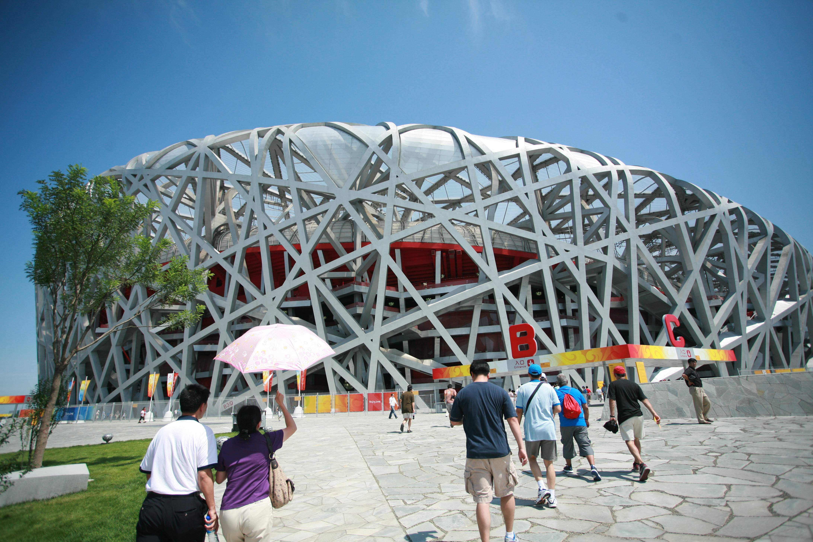

# Cultural Significance of Olympic Venues

Olympic venues can become recognizable parts of the Games and the cities that host them. Their significance can come from their architecture, the competitions and ceremonies held there, or the historical events associated with them. Some venues remain closely connected to a particular Olympic Games long after the competition ends. Others become landmarks that continue to represent the host city and its Olympic history through continued use, preservation, or recognition by visitors.

**Beijing National Stadium, known as the Bird's Nest, during the 2008 Summer Olympics.**\
&#x20;Source: Wikimedia Commons, photograph by Tom Nguyen

## Olympic Architecture and Identity

Architecture can give Olympic venues a distinct identity while reflecting the time and place in which they were built. Host cities have used stadiums, arenas, and other facilities to present architectural ideas and create recognizable symbols for the Games. Design features can also reflect local culture, existing surroundings, or broader development plans. When a venue has a distinctive appearance or plays a major role during the Games, its architecture can become closely associated with the identity of that Olympic host.

### Iconic Olympic Venues

Some Olympic venues have become especially recognizable because of their design, history, or association with memorable Olympic events. The Beijing National Stadium, commonly known as the Bird's Nest, became a symbol of the 2008 Summer Games because of its distinctive exterior design and role in the opening and closing ceremonies. The Sydney Opera House was not built as an Olympic venue, but its location along Sydney Harbour made it a prominent part of the visual identity surrounding the 2000 Games. Other venues gain recognition through repeated Olympic use, major athletic performances, or continued importance after the Games.