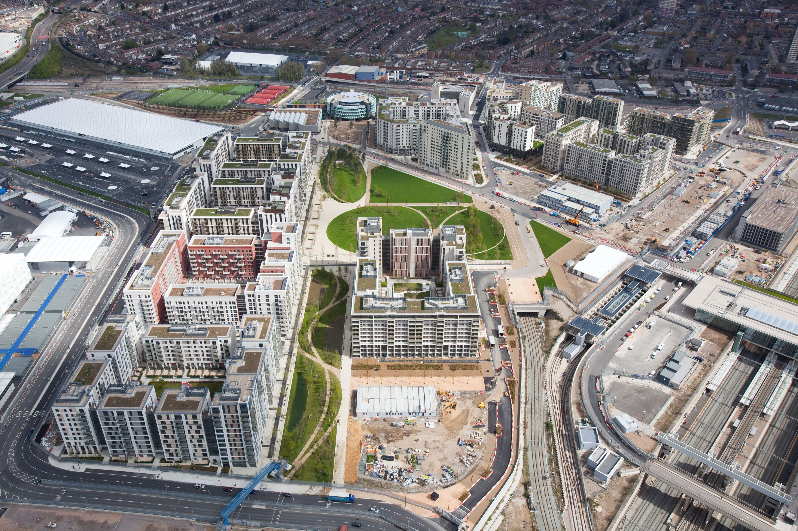

# Olympic Village Legacy

The legacy of an Olympic Village is shaped by what happens to the site after athletes and officials leave. Because villages can include large amounts of housing, infrastructure, public space, and supporting facilities, host cities often plan their long-term use before construction begins. Apartments built for athletes can become permanent housing, while other parts of the village may be converted into offices, shops, parks, or community facilities. The success of these plans can have a lasting effect on the neighborhoods where villages are built.

## Post-Olympic Use of Olympic Villages

Converting an Olympic Village to permanent use often requires changes after the Games. Temporary dining areas, security systems, transportation operations, and athlete services may be removed, while residential buildings are modified for permanent occupants. Host cities may use former villages for private housing, affordable housing, student residences, or mixed-use neighborhoods. Planning these uses in advance can help integrate the village into the surrounding community rather than leaving a large purpose-built site without a clear role after the Olympics.

### Successful and Controversial Village Legacies

Olympic Village legacies have produced different results. London's 2012 Olympic Village was converted into East Village, a permanent residential neighborhood that includes thousands of homes. Vancouver's 2010 village became a residential neighborhood but experienced major financing problems that required the city to take over financing during its development. The 1980 Lake Placid Olympic Village followed a different path: it was designed with its future use in mind and became a federal correctional institution after the Games. These examples show how Olympic Village sites can take on very different roles once their original Olympic purpose ends.

**Aerial view of the London 2012 Olympic and Paralympic Village before the Games.**\
&#x20;Source: Wikimedia Commons, photograph by Anthony Charlton / EG Focus for LOCOG