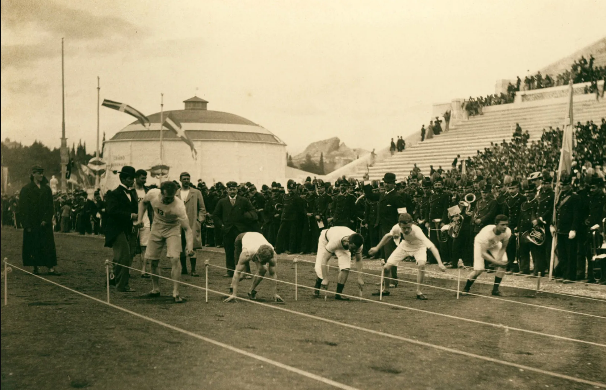

# Individual Sports

The first modern Summer Games in 1896 were largely built around individual sports, including track and field, cycling, fencing, gymnastics, shooting, swimming, tennis, weightlifting, and wrestling.

**Track and field competition at the first modern Summer Games in Athens, 1896.**  
Source: Encyclopaedia Britannica

As the Summer Games developed, the Olympic program expanded to include additional individual sports. Golf and archery made their Olympic debuts in 1900, followed by boxing in 1904 and judo in 1964. More recently, skateboarding and sport climbing made their Olympic debuts at Tokyo 2020.

## Individual Competition in the Summer Olympics

[[summer-olympic-competition|Individual Olympic competitions]] use different formats depending on the sport and event. Swimming and track and field races often begin with preliminary heats, and the fastest athletes or top finishers advance through later rounds to the final. Tennis and boxing use elimination brackets, where a loss can end an athlete's chance to advance. Gymnastics takes a different approach, with judges scoring routines based on factors such as difficulty and execution. Field events such as the long jump and shot put give athletes multiple attempts, with their best result used to determine placement.

### Major Olympic Individual Sports

The Summer Games include individual sports that differ in the skills required, equipment used, playing environment, and basic style of competition. Major Olympic individual sports include:

- **Swimming:** swimmers compete using different strokes over a variety of distances in a pool.
- **Track and Field:** includes running events on the track along with jumping and throwing events such as the long jump, high jump, shot put, and javelin.
- **Gymnastics:** athletes perform routines that combine strength, balance, flexibility, and coordination using different apparatus.
- **Tennis:** players use racquets to hit a ball over a net, competing individually in singles or with a partner in doubles.
- **Golf:** players use different clubs to complete a course of 18 holes in as few strokes as possible.
- **Cycling:** includes road, track, mountain bike, and BMX competitions that take place on different courses and surfaces.
- **Boxing:** athletes compete directly against an opponent in a ring using punches within established weight classes.
- **Archery:** athletes use bows to shoot arrows at targets from a set distance.
- **Shooting:** athletes use rifles, pistols, or shotguns in events that test accuracy and precision.