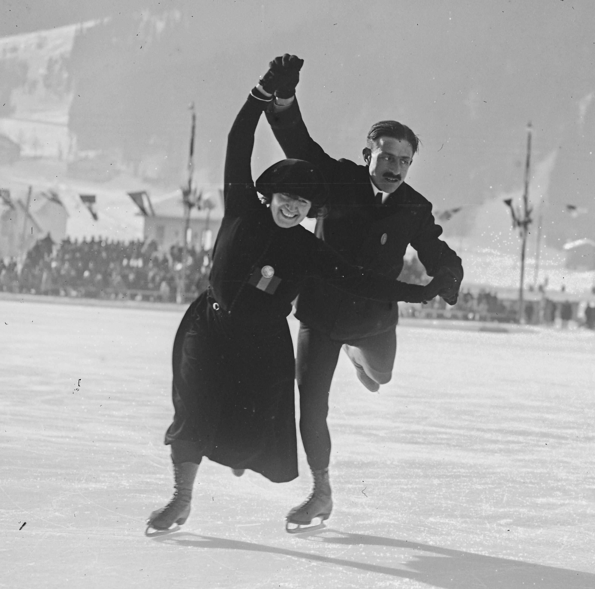

# History of the Winter Games

The Winter Olympic Games developed during the early 1900s as winter sports became more popular and gained a place in Olympic competition. Figure skating was included in the 1908 Games, while figure skating and ice hockey were contested in 1920. In 1924, the International Olympic Committee supported a separate winter sports competition in [[olympic-venues/olympic-venue-locations|Chamonix, France]]. Originally known as International Winter Sports Week, it was later recognized as the first Olympic Winter Games. The Chamonix competition featured 258 athletes from 16 nations competing in six sports and 16 events.

**Georgette Herbos and Georges Wagemans competing in pairs figure skating at the 1924 Winter Olympics in Chamonix, France.**\
&#x20;Source: Wikimedia Commons

## Origins and Development of the Modern Winter Olympics

The development of the Winter Games was influenced by an established winter sports tradition in Scandinavia. Beginning in Stockholm, Sweden, in 1901, the Nordic Games brought together competitions in a variety of winter sports and became an important predecessor to the Olympic Winter Games. Although the Nordic Games were independent of the International Olympic Committee, they demonstrated the growing interest in organized winter sports competition.

The success of the 1924 competition in Chamonix helped establish a separate Olympic competition for winter sports. In 1925, the International Olympic Committee decided to establish a separate cycle of Winter Games every four years, and Chamonix was later officially recognized as the first Olympic Winter Games.

### Major Historical Events of the Winter Games

The Winter Olympics have been affected by events and controversies that changed how the Games were held or how the Olympic movement operated. Some notable examples include:

- **1940 and 1944:** Both Winter Games were canceled because of World War II. The 1940 Games had already gone through several proposed host locations before they were abandoned.
- **1964 Innsbruck:** Australian alpine skier Ross Milne and British luger Kazimierz Kay-Skrzypeski died during training before the Games. Concerns about course safety followed the deaths, and additional safety measures were introduced before competition began.
- **2002 Salt Lake City:** A scandal involving improper gifts and benefits connected to Salt Lake City’s successful Olympic bid led to investigations, the resignation or removal of IOC members, and reforms to the Olympic host-city selection process.
- **2014 Sochi:** Investigations uncovered a Russian state-sponsored doping program that included manipulation of drug-testing samples. The scandal resulted in sanctions and restrictions that affected Russia’s participation in later Olympic Games.
- **2022 Beijing:** The COVID-19 pandemic required strict health and safety measures, including testing, isolation procedures, and restrictions intended to separate Olympic participants from the general public.